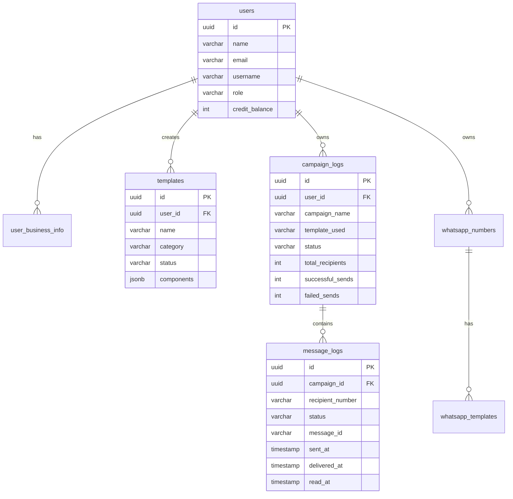

# Prime SMS Database Schema Overview

## Database Information
- **Database Name**: PrimeSMS_W
- **Port**: 5431
- **Type**: PostgreSQL
- **Extensions**: pgcrypto (for UUID generation)

---

## 📊 Complete Table Structure

### 1. **users** - User Management
**Purpose**: Core user accounts and authentication

| Column | Type | Constraints | Description |
|--------|------|-------------|-------------|
| `id` | UUID | PRIMARY KEY | Unique user identifier |
| `name` | VARCHAR(255) | NOT NULL | Full name of user |
| `email` | VARCHAR(255) | UNIQUE, NOT NULL | User email address |
| `username` | VARCHAR(100) | UNIQUE, NOT NULL | Login username |
| `password` | VARCHAR(255) | NOT NULL | Hashed password |
| `phone_number` | VARCHAR(20) | NULL | User's phone number |
| `role` | VARCHAR(20) | DEFAULT 'user' | User role (user/admin) |
| `credit_balance` | INTEGER | DEFAULT 0 | Available credits |
| `created_at` | TIMESTAMP | DEFAULT CURRENT_TIMESTAMP | Account creation time |
| `updated_at` | TIMESTAMP | DEFAULT CURRENT_TIMESTAMP | Last update time |

**Indexes**: None specified
**Triggers**: `update_users_updated_at` (auto-updates `updated_at`)

---

### 2. **user_business_info** - Business Configuration
**Purpose**: WhatsApp Business API credentials and settings

| Column | Type | Constraints | Description |
|--------|------|-------------|-------------|
| `id` | UUID | PRIMARY KEY | Unique business info identifier |
| `user_id` | UUID | NOT NULL, FK to users(id) | Associated user |
| `business_name` | VARCHAR(255) | NULL | Business name |
| `whatsapp_number` | VARCHAR(20) | NULL | WhatsApp phone number |
| `whatsapp_number_id` | VARCHAR(255) | NULL | Meta's phone number ID |
| `waba_id` | VARCHAR(255) | NULL | WhatsApp Business Account ID |
| `access_token` | TEXT | NULL | Meta API access token |
| `webhook_url` | VARCHAR(500) | NULL | Webhook endpoint URL |
| `webhook_verify_token` | VARCHAR(255) | NULL | Webhook verification token |
| `is_active` | BOOLEAN | DEFAULT true | Active status |
| `created_at` | TIMESTAMP | DEFAULT CURRENT_TIMESTAMP | Creation time |
| `updated_at` | TIMESTAMP | DEFAULT CURRENT_TIMESTAMP | Last update time |

**Constraints**: UNIQUE(user_id)
**Triggers**: `update_user_business_info_updated_at`

---

### 3. **templates** - WhatsApp Message Templates
**Purpose**: Store and manage WhatsApp Business API message templates

| Column | Type | Constraints | Description |
|--------|------|-------------|-------------|
| `id` | UUID | PRIMARY KEY | Unique template identifier |
| `user_id` | UUID | NOT NULL, FK to users(id) | Template owner |
| `name` | VARCHAR(255) | NOT NULL | Template name |
| `category` | VARCHAR(20) | NOT NULL | Template category (UTILITY/MARKETING/AUTHENTICATION) |
| `language` | VARCHAR(10) | DEFAULT 'en_US' | Template language |
| `status` | VARCHAR(20) | DEFAULT 'DRAFT' | Template status |
| `components` | JSONB | NOT NULL | Template structure (header, body, footer, buttons) |
| `template_id` | VARCHAR(255) | NULL | WhatsApp template ID |
| `message_send_ttl_seconds` | INTEGER | NULL | Message TTL |
| `allow_category_change` | BOOLEAN | DEFAULT true | Category change permission |
| `quality_rating` | VARCHAR(20) | NULL | WhatsApp quality rating |
| `whatsapp_response` | JSONB | NULL | Meta API response data |
| `rejection_reason` | TEXT | NULL | Rejection details |
| `header_type` | VARCHAR(20) | DEFAULT 'NONE' | Header component type |
| `created_at` | TIMESTAMP | DEFAULT CURRENT_TIMESTAMP | Creation time |
| `updated_at` | TIMESTAMP | DEFAULT CURRENT_TIMESTAMP | Last update time |

**Constraints**: 
- UNIQUE(user_id, name)
- CHECK (category IN ('UTILITY', 'MARKETING', 'AUTHENTICATION'))
- CHECK (status IN ('DRAFT', 'IN_REVIEW', 'PENDING', 'ACTIVE', 'REJECTED', 'PAUSED', 'DISABLED', 'APPEAL_REQUESTED'))
- CHECK (header_type IN ('NONE', 'TEXT', 'STATIC_IMAGE', 'DYNAMIC_IMAGE', 'STATIC_VIDEO', 'DYNAMIC_VIDEO'))

**Indexes**:
- `idx_templates_user_id` (user_id)
- `idx_templates_status` (status)
- `idx_templates_category` (category)
- `idx_templates_template_id` (template_id)

**Triggers**: `update_templates_updated_at`

---

### 4. **campaign_logs** - Campaign Management
**Purpose**: Track bulk messaging campaigns

| Column | Type | Constraints | Description |
|--------|------|-------------|-------------|
| `id` | UUID | PRIMARY KEY | Unique campaign identifier |
| `user_id` | UUID | NOT NULL, FK to users(id) | Campaign owner |
| `campaign_name` | VARCHAR(255) | NOT NULL | Campaign name |
| `template_used` | VARCHAR(255) | NOT NULL | Template name used |
| `phone_number_id` | VARCHAR(255) | NULL | WhatsApp number ID |
| `language_code` | VARCHAR(10) | DEFAULT 'en' | Campaign language |
| `total_recipients` | INTEGER | DEFAULT 0 | Total recipients |
| `successful_sends` | INTEGER | DEFAULT 0 | Successful messages |
| `failed_sends` | INTEGER | DEFAULT 0 | Failed messages |
| `status` | VARCHAR(20) | DEFAULT 'pending' | Campaign status |
| `campaign_data` | JSONB | NULL | Template variables, buttons, etc. |
| `error_message` | TEXT | NULL | Error details |
| `created_at` | TIMESTAMP | DEFAULT CURRENT_TIMESTAMP | Creation time |
| `updated_at` | TIMESTAMP | DEFAULT CURRENT_TIMESTAMP | Last update time |

**Constraints**: CHECK (status IN ('pending', 'processing', 'completed', 'failed', 'paused'))

**Indexes**:
- `idx_campaign_logs_user_id` (user_id)
- `idx_campaign_logs_status` (status)
- `idx_campaign_logs_created_at` (created_at DESC)

**Triggers**: `update_campaign_logs_updated_at`

---

### 5. **message_logs** - Individual Message Tracking
**Purpose**: Track individual message delivery status

| Column | Type | Constraints | Description |
|--------|------|-------------|-------------|
| `id` | UUID | PRIMARY KEY | Unique message identifier |
| `campaign_id` | UUID | NOT NULL, FK to campaign_logs(id) | Associated campaign |
| `recipient_number` | VARCHAR(20) | NOT NULL | Recipient phone number |
| `message_id` | VARCHAR(255) | NULL | Meta API message ID |
| `status` | VARCHAR(20) | DEFAULT 'pending' | Message status |
| `error_message` | TEXT | NULL | Error details |
| `api_response` | JSONB | NULL | Full Meta API response |
| `sent_at` | TIMESTAMP | NULL | Sent timestamp |
| `delivered_at` | TIMESTAMP | NULL | Delivered timestamp |
| `read_at` | TIMESTAMP | NULL | Read timestamp |
| `created_at` | TIMESTAMP | DEFAULT CURRENT_TIMESTAMP | Creation time |

**Constraints**: 
- CHECK (status IN ('pending', 'sent', 'delivered', 'read', 'failed'))
- UNIQUE (campaign_id, recipient_number)

**Indexes**:
- `idx_message_logs_campaign_id` (campaign_id)
- `idx_message_logs_status` (status)
- `idx_message_logs_recipient` (recipient_number)

---

### 6. **whatsapp_numbers** - WhatsApp Business Numbers
**Purpose**: Store user's WhatsApp Business phone numbers

| Column | Type | Constraints | Description |
|--------|------|-------------|-------------|
| `id` | UUID | PRIMARY KEY | Unique number identifier |
| `user_id` | UUID | NOT NULL, FK to users(id) | Number owner |
| `phone_number_id` | VARCHAR(255) | NOT NULL | Meta's phone number ID |
| `phone_number` | VARCHAR(20) | NOT NULL | Phone number |
| `display_name` | VARCHAR(255) | NULL | Display name |
| `verified_name` | VARCHAR(255) | NULL | Verified business name |
| `access_token` | TEXT | NOT NULL | API access token |
| `webhook_url` | VARCHAR(500) | NULL | Webhook URL |
| `webhook_verify_token` | VARCHAR(255) | NULL | Webhook token |
| `is_active` | BOOLEAN | DEFAULT true | Active status |
| `created_at` | TIMESTAMP | DEFAULT CURRENT_TIMESTAMP | Creation time |
| `updated_at` | TIMESTAMP | DEFAULT CURRENT_TIMESTAMP | Last update time |

**Constraints**: UNIQUE(user_id, phone_number_id)

**Indexes**:
- `idx_whatsapp_numbers_user_id` (user_id)
- `idx_whatsapp_numbers_active` (is_active)

**Triggers**: `update_whatsapp_numbers_updated_at`

---

### 7. **whatsapp_templates** - Cached Templates
**Purpose**: Cache approved WhatsApp templates from Meta API

| Column | Type | Constraints | Description |
|--------|------|-------------|-------------|
| `id` | UUID | PRIMARY KEY | Unique template identifier |
| `phone_number_id` | VARCHAR(255) | NOT NULL | Associated phone number |
| `template_name` | VARCHAR(255) | NOT NULL | Template name |
| `language` | VARCHAR(10) | NOT NULL | Template language |
| `category` | VARCHAR(50) | NULL | Template category |
| `status` | VARCHAR(20) | DEFAULT 'APPROVED' | Template status |
| `template_data` | JSONB | NOT NULL | Complete template structure |
| `components` | JSONB | NULL | Template components |
| `created_at` | TIMESTAMP | DEFAULT CURRENT_TIMESTAMP | Creation time |
| `updated_at` | TIMESTAMP | DEFAULT CURRENT_TIMESTAMP | Last update time |

**Constraints**: UNIQUE(phone_number_id, template_name, language)

**Indexes**:
- `idx_whatsapp_templates_phone_number` (phone_number_id)
- `idx_whatsapp_templates_status` (status)

**Triggers**: `update_whatsapp_templates_updated_at`

---

## 🔗 Table Relationships

---

## 📈 Key Features

### **User Management**
- Multi-role system (user/admin)
- Credit balance tracking
- Business information storage

### **Template Management**
- WhatsApp Business API template creation
- Template approval workflow
- Component-based template structure
- Quality rating tracking

### **Campaign Management**
- Bulk messaging campaigns
- Real-time status tracking
- Success/failure metrics
- Template variable support

### **Message Tracking**
- Individual message status
- Delivery confirmation
- Read receipts
- Error handling

### **WhatsApp Integration**
- Multiple phone number support
- Template caching
- Webhook management
- API credential storage

---

## 🔧 Database Functions & Triggers

### **Auto-update Triggers**
All tables with `updated_at` columns have automatic update triggers:
- `update_users_updated_at`
- `update_user_business_info_updated_at`
- `update_templates_updated_at`
- `update_campaign_logs_updated_at`
- `update_whatsapp_numbers_updated_at`
- `update_whatsapp_templates_updated_at`

### **UUID Generation**
Uses PostgreSQL's `pgcrypto` extension for secure UUID generation with `gen_random_uuid()`.

---

## 📊 Sample Data

The database includes sample data for testing:
- Admin user: `primesms` / `Primesms`
- Test user: `testuser` / `test123`
- Sample WhatsApp numbers and templates
- Sample campaign and message logs

---

## 🚀 Performance Optimizations

- **Indexes** on frequently queried columns
- **JSONB** for flexible data storage
- **Proper constraints** for data integrity
- **Cascading deletes** for referential integrity
- **Timestamp tracking** for audit trails 